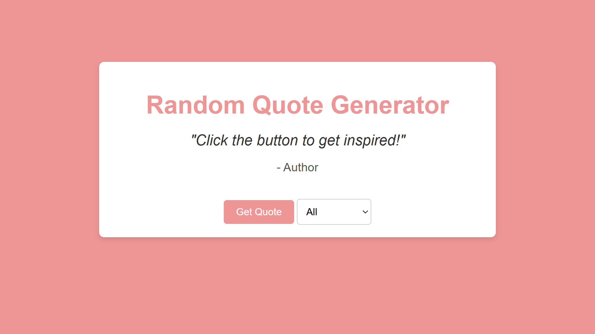

# Random Quote Generator 

A simple and interactive random quote generator built using HTML, CSS, and JavaScript. Click the button to display a random inspirational quote.

## Features
- Displays random quotes with a single click.
- Clean and responsive design.

## Usage
1. Clone the repository:

    ```bash
    git clone https://github.com/marwan-ahmed-23/random-quote-generator-js.git
    ```

2. Open index.html in your browser to see the project in action.

## Demo




## Directory Structure
```plaintext
random-quote-generator-js/
├── assets/ 
│ └── screenshot.png 
├── index.html          # Main HTML file
├── style.css           # Stylesheet
├── quotes.json         
├── script.js           # JavaScript functionality
└── README.md           # Project documentation
```

## Contributing

Contributions are welcome! Feel free to fork the repository and submit a pull request.
